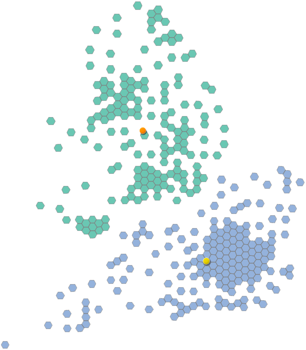
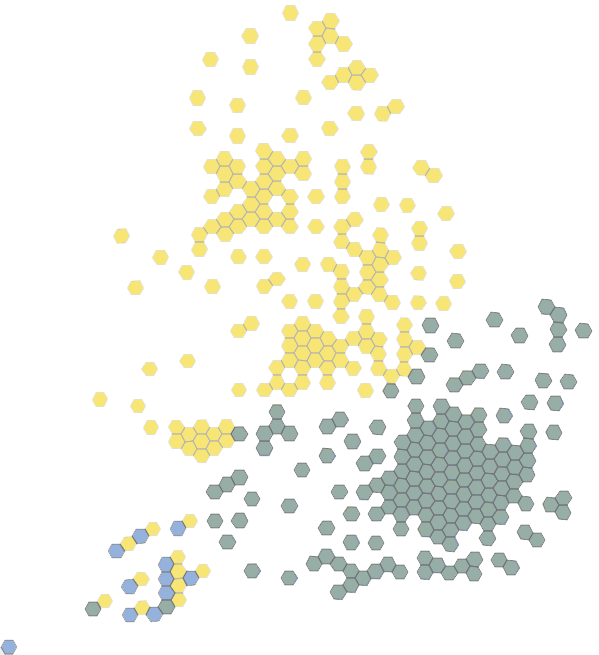
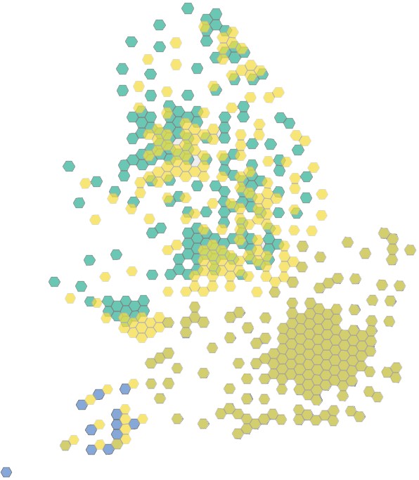

# -	Do you need to display data on a map?
-	Is the geography you need to map made up of sub-units of widely differing sizes?
-	Are the most interesting data to be found in the smaller areas?
-	Alternatively, are your data located at point that are by turns tightly concentrated and widely scattered? 

If the above apply, then this is definitely for you. 

We have created a tool written in Python to create equal area cartograms (EACs) based on hexagonal grids. The purpose is to get around the visual dominance of large areas on maps, and the tendency for smaller areas to be overlooked. This document explains the nature of the problem and considers alternative solutions before turning to hexmaps. 

The ONS approach has been successfully tested on a wide range of geographies with an extreme range of scales. 

We explain how to set up the script and your data to run on any PC running 64-bit Windows 7 or 10.  

We then go through some examples to demonstrate how the methodology works. 

We are separately developing an R-based method for automating the production of square-based (waffle chart) EACs.


## Header Size 2
<p align="center">
  
  
  
  
  
  
  
</p>

Lorem ipsum dolor sit amet, consectetur adipiscing elit, sed do eiusmod tempor incididunt ut labore et dolore magna aliqua. Ut enim ad minim veniam, quis nostrud exercitation ullamco laboris nisi ut aliquip ex ea commodo consequat. Duis aute irure dolor in reprehenderit in voluptate velit esse cillum dolore eu fugiat nulla pariatur. Excepteur sint occaecat cupidatat non proident, sunt in culpa qui officia deserunt mollit anim id est laborum

* bullet point
* bullet point
* bullet point

## Header Size 2

  

Lorem ipsum dolor sit amet, consectetur adipiscing elit, sed do eiusmod tempor incididunt ut labore et dolore magna aliqua. Ut enim ad minim veniam, quis nostrud exercitation ullamco laboris nisi ut aliquip ex ea commodo consequat. Duis aute irure dolor in reprehenderit in voluptate velit esse cillum dolore eu fugiat nulla pariatur. Excepteur sint occaecat cupidatat non proident, sunt in culpa qui officia deserunt mollit anim id est laborum

* bullet point
* bullet point
* bullet point

#  = HEADING 1 with underline

## = HEADING 2 with underline

- = BULLET

- **txtString** = BOLD BULLET

`txtString` =  grey box emphasis

``` sh
txtString  =  grey box emphasis - extra line above and below

```
[txtLink](https://github.com/huggingface/pytorch-pretrained-BERT) = enabled weblink
```

```python
# comment
script
```


