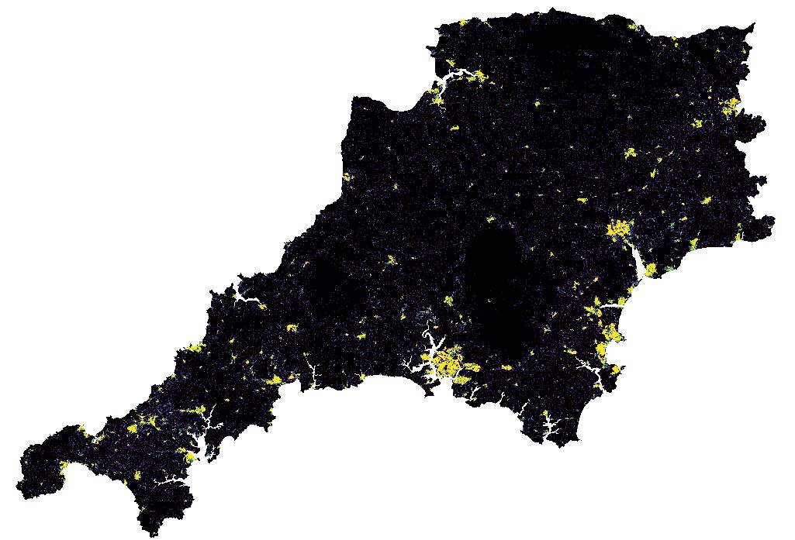

#  AUTOMATED GENERATION OF EQUAL AREA CARTOGRAMS (‘HEXMAPS’) AT ANY SCALE

# Do you need to map data?

-	Does your geography comprise polygon sub-units of widely differing sizes?
-	Are the most interesting data to be found in the smaller areas?
-	Alternatively, are your data located at points that are by turns tightly concentrated and widely scattered? 

If so, then this is definitely for you. 

Our Python tool creates equal area cartograms (EACs) based on hexagonal grids. Its principal purpose is to get around the visual dominance of large areas on maps, and the tendency for smaller areas to be overlooked. Please refer to  
[the report](https://github.com/ONS-Geography-Research/HexMapping/blob/master/Report/Hexmapping_2019_06_24_0910.pdf) for details on the the nature of the problem and how to set up and run the tool on your data to run on any PC running 64-bit Windows 7 or 10.  

The ONS approach has been successfully tested on a wide range of geographies with an extreme range of scales. 

Please note: we are separately developing an R-based method for automating the production of square-based (waffle chart) EACs.

## Introduction

Thematic mapping draws attention to statistical difference across space. Statistical values of interest are often attached to sub-areas of the overall geography, and this may reveal significant spatial variations. However, administrative divisions commonly encompass a range of unit sizes, from small urban districts to large rural expanses. 

## The tyranny of large areas

When seen together on a map, larger units tend to dominate and the smaller to recede. The eye is drawn to large areas. Those familiar with the geostatistics behind any given map may be able to apply a mental filter to compensate, but the fact remains that the areas where the chief interest of your story resides may be small and hard to see. Think of Canada, Australia and Russia, where huge areas, often relatively sparse in socio-economic statistics, acquire visual dominance at the expense of the smaller and often more populated areas.


Here in the UK it is a similar story. Local Authority Districts (LADs) in the UK range in size from the 290 hectares of the City of London to the 2.6 million hectares of the Highlands of Scotland – but the two are administratively equivalent.  On a national map, the City of London is completely invisible. 

British statistical geographies (Census output areas) are just as vulnerable to the issue as the administrative geographies.  They are based on population thresholds, so are made up of units (instances) which are small where the population is dense, and large where it is spread thinly.  At the middle level [MSOA (EW), DataZones (Sc) and Small Areas (NI)], they range from just over 1 hectare (ha) to 180,000 ha, 


One is usually encouraged to use rate data for choropleths instead (e.g. percentage of one species of tree in the forest) as that were the perfect solution. But the tyranny of large areas persists regardless of your data type – a larger forest is more visible. 


## Cartograms

But it is possible to set aside the visual dominance of large areas altogether. One can scale the territories not according to their actual geographic area, but according to a value of statistical interest. This is known as a cartogram – a hybrid statistical graph / map, a compromise by which the viewer gains more immediate access to the data but loses some of the geographical context.  
Cartograms exist in many forms; they may preserve, or ignore, shape, contiguity and orientation. They are often shown together with a conventional map to aid navigation and interpretation. They can powerfully convey general impressions (see the examples below from Benjamin Henning’s ‘WorldMapper’  ), but it’s hard to derive specific values, and next to impossible to assess whether differently shaped areas represent the same statistical value. Also, a new cartogram must be drawn for each new variable, refreshing the navigational challenge every time.

## The Equal Area Cartogram 

Our favoured approach is the equal area cartogram (EAC). Here, every district is represented with an identical geometric object of equal size and shape, and therefore, area. No area is inherently (dis)advantaged, as the base geometric representation of all is the same.  Once generated, the EAC provides a single standard layout that can be linked to countless datasets to generate as many thematic maps as desired. 

## The ONS hexmapping tool
Within this project, we have concentrated upon automatic hexmap generation using Python. Our code runs quickly and can operate on any polygon dataset at any scale.  
We have tested the product on a wide range of distinctive and challenging geographies. These include countries with predominantly north-south extent (Chile, Italy, Norway), countries with east-west extent (Russia, USA), irregular shapes (Croatia), exclaves (Russia’s Kaliningrad), doughnuts (Germany - Berlin within Brandenburg), complex archipelagos (Indonesia). It works on all, regardless of projection or scale. Indeed, it works equally well on all the stars within ten parsecs of Sol (our sun) and a tiny detail from an electron microscope image of the brain of a fly.
As your input geography is imported, its projection is noted: it is then turned into pure geometry for the hexmap creation and then re-exported back to its original projection. Two hexmap variants are available. The basic variant overlays the original input geography and the two may be used together. The compressed hexmap is designed to stand alone, without the original geography or a base map. However, because it is in the same projection as the original input geography and the basic hexmap, you may overlay them for testing purposes, to assess the effectiveness of the compression.

Speed of execution depends upon your PC’s resources and the complexity of the input spatial dataset: for over ¾ of tested geographies, the compressed hexmap is created within ten seconds. Only three took more than one minute – the 1,973 Cantons of France (138s); the 1,385 NUTS3 units of the WEU and EFTA (150 s) and the 7,201 MSOAs of England and Wales (40 minutes).
 
### Using the tool

### A. PREREQUISITES
### B.	SETUP

#### B1. SETUP FILES
HexTool__Setup.py
HexTool__Geographies_UK.py  or HexTool__Geographies_Elsewhere.py
#### B2. CORE CODE
HexTool__Basic.py
#### B3. CORE CODE WITH COMPRESSION
	HexTool__Compressed.py
#### B4. SETUP PROCEDURE
PATHS AND FOLDERS
GEOGRAPHY
HEXMAP TYPE 
GRAVITY FUNCTION CORRECTION (F_CORRECTION)
OUTPUT FILE TYPE
B5. SETUP PROCEDURE – FOR A BASIC HEXMAP

INPUT POLYGON and PARAMETERS
B6. SETUP PROCEDURE – FOR A COMPRESSED HEXMAP

Within script “HexTool__Geographies_UK.py”  or “HexTool__Geographies_Elsewhere.py”

INPUT POLYGON and PARAMETERS
COMPRESSION_FACTOR

RETURN TO AND RUN script “HexTool__Setup.py”


Examples

Here, several versions of the basic hexmap have been generated, each with a different hex-size. Here, the results for 100, 150 and 200 meters are shown. HEXSIZE = 100 meters produces a basic hexmap where all hex centroids are within the original boundary polygon.
Retaining the parameter values from the basic hexmap, several compressed hexmaps are now created, with varying COMPRESSION_FACTOR values applied to the 100-meter hexagons. A favourable result for this geography is gained with COMPRESSION_FACTOR = 1.8.

The Compression Algorithm
How the compression works can perhaps most effectively be shown on the example of districts in the Russian Federation. This is on account of its very skewed composition = there are 85 districts of which the smallest (Sevastopol) is 616 sq.km. The largest (Sakha (Yakutia)) covers over 3 million sq.km. 30 districts are over 100,000 km sq. km. in area, and these are all in the north or east.  In addition, Kaliningrad and Sevastopol + the Crimea) are detached from mainland Russia.

As we have already seen, a choropleth map of this geography will be dominated by the large Siberian areas, while the small areas will be all but invisible. However, socio-economic data is likely to be concentrated in the smaller areas. A hexmap will equalise the visual impact of each district, but without compression, will leave large gaps due to the enormous distances involved.

On the basic hexmap, each hexagon is rooted to the geometric centroid of its district: 
 
The geographical distribution is faithfully represented and the hexmap accurately overlays on a basemap. But in the case of Russian districts, the hex size that best achieves this (each hex being 190,000 km top to bottom [they’re pointy-uppy]) means that there’s an enormous amount of empty space, and this results in small hexagons whose labels are hard to read. It would also be hard to interpret any thematic data that was pinned to them (by colour). So, this is a geography for which a compressed hex map would make perfect sense.

We drop the basemap but for the moment leave the boundaries for reference. Six peripheral districts are labelled - these will have furthest to travel towards the centroid of centroids (CxC).  
 As the Compression Factor is adjusted (remember that CF=1,000 is practically no compression, while 1 is extreme compression), the gravitational attraction of the CxC varies.

At CF = 3.0, the pattern remains recognisably that of the districts of the Russian Federation –  we still have the concentration of districts in western Russia, Kaliningrad Oblast is still separated, the Crimea and Caucasus are distinct, as is the scatter eastwards across the Urals into Asia.   Yet now, we can zoom to the hexmap layer – so making the hexagons larger and their labelling clearer. 

Complex archipelagos

The program also works with highly complex and regionally differentiated geographies such as Indonesia. 

Here, 270 Kabupaten or ‘regencies’ are distributed across a huge number of islands. There is considerable variation in size, generally being large on the islands of Borneo and New Guinea, but tiny on the densely inhabited island of Java. This is a classic example of the shortcomings of choropleth mapping. In terms of mapping socio-economic data at this administrative level, Java will always be disadvantaged. 

Producing a simple hexmap will leave large spaces, especially in the less-densely populated Borneo and New Guinea. 

An uncompressed hexmap (HEXSIZE = 0.6 decimal degrees) will result in the concentration of regencies on Java expanding well beyond the island’s coast, while great spaces exist between the hexes representing the extensive regencies on Borneo and New Guinea. As with Russia, the HEXSIZE required to accommodate this diverse geography means that effective labelling is very challenging. 

With a COMPRESSION FACTOR of CF=3 the large gaps are reduced while clearly retaining the overall pattern. One can then zoom into the map and label it far more effectively. 

Where clusters of spatial units could cause unreasonable distortions of the overall pattern, these can be extracted to inset maps alongside the general map. Unlike the earlier example, areas not selected for inset mapping are not disadvantaged. 
Furthermore, generating individual hexmaps for the inset areas results in a better approximation to their actual shape than can be achieved by creating a single overall hexmap. Both basic and compressed hexmap variants (with the inset areas extracted) can more accurately display the areas around the periphery of the inset areas (see around London).
The West Midlands region encompasses some to of the most rural and some of the most urban parts of England, giving rise to a 700-fold size difference between smallest and largest of the 735 MSOAs in the region. 
It is therefore not practicable to produce an MSOA-level choropleth, graduated or proportional symbol, or basic hexmap of the entire region (scale 1:820,000). On the other hand, a compressed hexmap (at 1:525,000) can succeed.  
Regional and multiple compression

For some hierarchical geographies (e.g. Local Authorities within regions within countries) with distinct spatial patterns, and where it may be important to retain these, it may be desirable to initially generate regional hexmaps before combining these into a hexmap for the whole geography. Projection, HEXSIZE and other parameters must be common across all regions. 

But each regional hexmap will have its own CxC drawing the individual hexes inwards, and this will cause gaps to open up between regions.  The datasets should then be merged into a single shapefile, and the gaps can then be manually removed by shifting the hexes of one region towards the other, respecting the common hexagonal mesh.

              

If excessive space between the individual hexagons on a compressed hexmap is disturbing, this may be reduced by one or more further round(s) of compression. 

Other scales
Local

The methodology may have applicability well beyond the scales normally used for cartography, and well beyond social geostatistics. Whether the application of this techniques to data at these scales, and which are inherently three-dimensional, is helpful or even appropriate, must be left to the relevant subject experts. We offer it as a proof of concept.  

Our first example is a set of marine biology sample points in a small part of Plymouth harbour, used with permission of Dr Benjamin Ciotti of the University of Plymouth’s School of Marine Biology.  The x-y location of each sampled point was recorded along with depth and data on the various species found there. Given the clustering and dispersal of the sampling points, employing proportional symbols in their actual locations would be inefficient, with both large gaps and overlaps. The sampling data may be communicated more effectively with a compressed hexmap. 
Microscopic

Zooming right in, we have generated a compressed hexmap from an electron microscope image of the brain of a fly.  In the absence of spatial data on the image (covering 4mm2), and purely as a proof of concept, I converted the image file to vectors and applied a simple Cartesian coordinate system. I then created and mapped a simple (and meaningless) 8-value categorical scale.  

Cosmic

Looking further afield, the technique may also be used at the cosmic scale. The HYG Database is a meta-catalogue containing over 120,000 stars. It includes the x,y,z, Cartesian coordinates of the star (in a system based on the equatorial coordinates as seen from Earth), distance from earth and a range of other fields. Once a suitable buffer is generated for each point to create polygons, a compressed hexmap may easily be generated for any subset of the catalogue. We have generated a compressed hexmap of all the stars within ten parsecs of Sol (our sun).   

 
Summary

We have created a tool that can be used to quickly and efficiently create hex-based equal area cartograms from any dataset that includes cartesian or projected coordinates, regardless of the scale. 

It is most suitable for datasets where the area of polygons, or the distances between points, is highly variable.

The script requires a polygon input. A point dataset must first be converted to polygon by generation of buffers.

Your polygon dataset must then be placed in the INPUT_POLYGON folder, whose location is defined in script ‘HexTool__Setup.py’. 

Within ‘HexTool__Setup.py’, select basic or compressed hexmap. 

It must also be added to ‘HexTool__Geographies.py’ as GEOGRAPHY_NAME. You also have to select values for HEXSIZE, HEXORIENTATION and COMPRESSION_FACTOR.  Note that a value is required for COMPRESSION_FACTOR even if you are creating a basic hexmap. Use ‘3’ as the default.

Run ‘HexTool__Setup.py’.

Geometry and image files will be generated and placed in the output folders specified.

Play with the HEXSIZE, HEXORIENTATION and COMPRESSION_FACTOR parameters until you are satisfied. 

Note: if you use a decimal for the COMPRESSION_FACTOR, e.g.2.5, while the folder for the output will be named correctly (e.g. ID_KABUPATEN__EPSG_4326_WGS84_0.6_1_CF2.5_hexmap), the name of the shapefile within it will be curtailed to the decimal (e.g. ID_KABUPATEN__EPSG_4326_WGS84_0.6_1_CF2). If you try several options (e.g. CH+ 2.8, 2.6, 2.4) they will all be in separate, correctly named folders, but will have identical filenames. 


Recommended testing:

First: try out some of the geographies supplied with this tool with the parameters as set up in the Python script ‘HexTool__Geographies_UK.py’ or ‘HexTool__Geographies_Elsewhere.py’. 

Then see what happens when you alter HEXSIZE, HEXORIENTATION and COMPRESSION_FACTOR.

Add some of your own data (as ESRI shapefile) to the INPUT_POLYGON_PATH and to the appropriate ‘HexTool__Geographies_....py’  folder. Experiment with the three parameters.


DESIRABLE OPTIMISATIONS 

•	Currently, the optimal values for hex size, hex orientation and the compression factor must all be obtained by trial and error. It should be possible to calculate optimal values by reference to the perimeter envelope of the input geography, the number of spatial entities within it and the units of the spatial reference system (projection). 
•	The transformation function could be refined with the inclusion of a friction function to supplement the existing gravity function. There is something similar in D3.js
•	The tool should be able to accept as input any spatial file format rinsed by Fiona, but ity’s currently set up only to accept ESRI shapefiles as input and to write output also to shapefile. Adding other formats at both ends (e.g. geopackage, geoJSON) – should be fairly straightforward. 

•	The basic and compressed code began as a single script, remain essentially the same and should really be merged back into each other, incorporating a conditional IF COMPRESSED HEXMAP – ACTIVATE COMPRESSION CODE – ELSE SKIP clause. Otherwise there's double the maintenance.  A 'compressed' switch should be added to the parameters. 
•	Some of the linear code ought to be rewritten as functions
•	Perhaps a completion bar / hourglass / sound on completion could be added?
•	Under some circumstances, multithreading would help.


 
ERRORS


ATTRIBUTEERROR: 'FLOAT' OBJECT HAS NO ATTRIBUTE '__GEO_INTERFACE__'
 
CAUSE: GEOGRAPHY_NAME has an unknown projection, or HEXSIZE too small. 
Solutions: choose and apply appropriate projection for the geography, change HEXSIZE


DRIVERERROR: PATH/FILENAME.SHP:  NO SUCH FILE OR DIRECTORY. 

CAUSE: typos. Can also occur if you use multiple Python interpreters on the scripts
Solutions: check you typing. Stick with oneinterpreter!

 
VALUEERROR: THE SECOND INPUT GEOMETRY IS EMPTY

CAUSE: The HEXSIZE value is not appropriate for the combination of geography extent and geometry unit. Example: global decimal degree extent -180 to + 180 but HEXSIZE = 60000
Solutions: change HEXSIZE to appropriate scale. Check the axes on the INPUT_POLYGON.png to see the min/max x and y. HEXSIZE should be something like the min/max RANGE divided by the number of map units.


VALUEERROR: THE TRUTH VALUE OF AN ARRAY WITH MORE THAN ONE ELEMENT IS 
AMBIGUOUS. USE A.ANY() OR A.ALL()

CAUSE:  failing to delete variables at the end of the scripts.


'MAXIMUM ALLOWED SIZE EXCEEDED'

CAUSE: COMPRESSION_FACTOR = 0. Must be at least 1. Min 1.5 recommended.


ATTRIBUTEERROR: MODULE 'HEXTOOL__SETUP' HAS NO ATTRIBUTE 'INPUT_POLYGON_PATH'

This error paired with occasional double-running of the script. It’s to do with:
import HexTool__core_coreOnly.py and import HexTool__core_withTransform.py.
These scripts both ‘import HexTool__Setup as parameters’ and 
INPUT_POLYGON_PATH = parameters.INPUT_POLYGON_PATH
OUTPUT_IMAGE_PATH = parameters.OUTPUT_IMAGE_PATH
OUTPUT_HEXMAP_PATH = parameters.OUTPUT_HEXMAP_PATH
OUTPUT_FILE_TYPE = parameters.OUTPUT_FILE_TYPE
… but both are run from HexTool__Setup.py


## Header Size 2

  

Lorem ipsum dolor sit amet, consectetur adipiscing elit, sed do eiusmod tempor incididunt ut labore et dolore magna aliqua. Ut enim ad minim veniam, quis nostrud exercitation ullamco laboris nisi ut aliquip ex ea commodo consequat. Duis aute irure dolor in reprehenderit in voluptate velit esse cillum dolore eu fugiat nulla pariatur. Excepteur sint occaecat cupidatat non proident, sunt in culpa qui officia deserunt mollit anim id est laborum

* bullet point
* bullet point
* bullet point

#  = HEADING 1 with underline

## = HEADING 2 with underline

- = BULLET

- **txtString** = BOLD BULLET

`txtString` =  grey box emphasis

``` sh
txtString  =  grey box emphasis - extra line above and below

```
[txtLink](https://github.com/huggingface/pytorch-pretrained-BERT) = enabled weblink
```

```python
# comment
script
```


